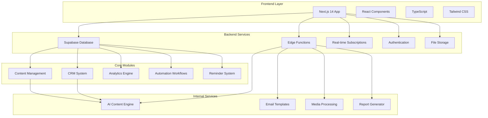
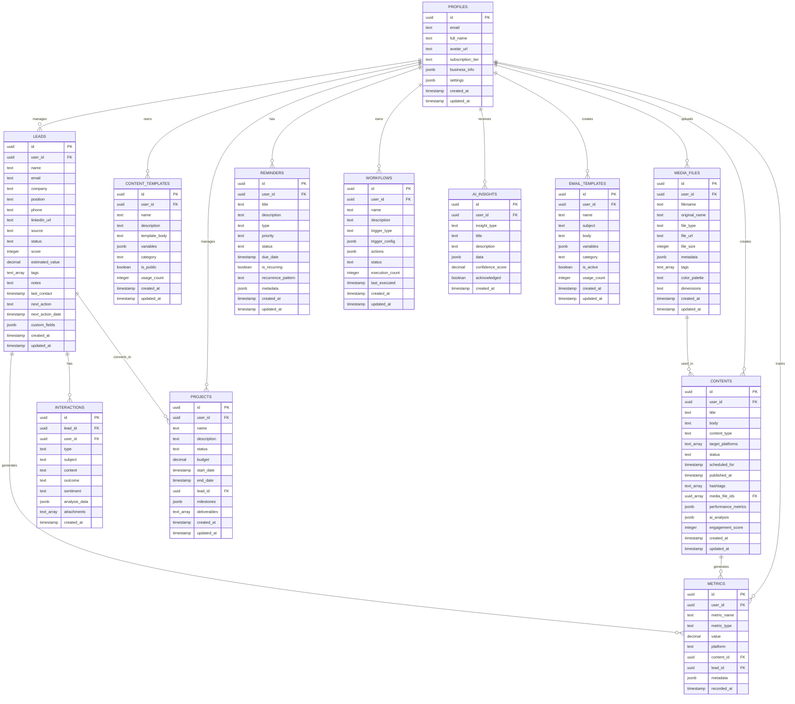
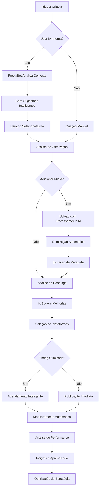
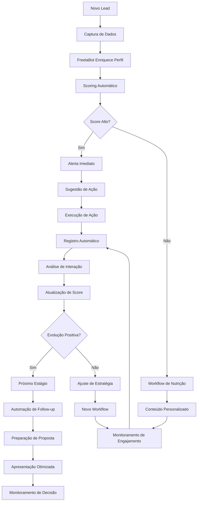

# FreelaHub - Sistema de Gerenciamento para Freelancer Tech

-----

## 🎯 **VISÃO GERAL DO SISTEMA**

Sistema integrado de gestão para freelancers de tecnologia, focado em produtividade, automação e crescimento profissional. A plataforma combina gestão de conteúdo, CRM, análise de dados e automação de processos em uma solução única e eficiente, com foco total na funcionalidade interna sem dependências de APIs externas.

### **Objetivos Principais**

- Centralizar todas as atividades do freelancer em uma plataforma única
- Automatizar tarefas repetitivas e processos de relacionamento
- Fornecer insights baseados em dados para tomada de decisões
- Simplificar a gestão de conteúdo e presença digital
- Otimizar o pipeline de vendas e relacionamento com clientes

-----

## 🏗️ **ARQUITETURA DO SISTEMA**



### **Stack Tecnológica**

```yaml
Frontend:
  - Next.js 14 (App Router)
  - TypeScript
  - Tailwind CSS
  - Shadcn/ui
  - React Hook Form
  - Zustand (State Management)

Backend:
  - Supabase (PostgreSQL)
  - Edge Functions (Deno)
  - Row Level Security (RLS)
  - Real-time Subscriptions
  - Supabase Storage

Internal Services:
  - Content AI Engine (Próprio)
  - Email System (Interno)
  - Media Processing (Interno)
  - Report Generator (Interno)
  - Analytics Engine (Próprio)

Deployment:
  - Vercel (Frontend)
  - Supabase (Backend)
  - GitHub Actions (CI/CD)
```

-----

## 📊 **MODELO DE DADOS**



-----

## 🎨 **DESIGN E INTERFACE**

### **Estrutura de Navegação**

```
┌─ Dashboard Principal
├─ Gestão de Conteúdo
│  ├─ Editor de Posts
│  ├─ Calendário Editorial
│  ├─ Templates de Conteúdo
│  ├─ Biblioteca de Mídia
│  └─ Análise de Performance
├─ CRM & Leads
│  ├─ Lista de Leads
│  ├─ Pipeline de Vendas
│  ├─ Histórico de Interações
│  ├─ Projetos
│  └─ Relatórios CRM
├─ Analytics
│  ├─ Métricas de Conteúdo
│  ├─ Performance de Vendas
│  ├─ Análise de Tendências
│  └─ Relatórios Personalizados
├─ Automação
│  ├─ Workflows
│  ├─ Lembretes
│  ├─ Templates de Email
│  └─ Sequências Automatizadas
├─ IA & Insights
│  ├─ Análise de Conteúdo
│  ├─ Sugestões Inteligentes
│  ├─ Predições
│  └─ Recomendações
└─ Configurações
   ├─ Perfil
   ├─ Preferências
   ├─ Notificações
   └─ Assinatura
```

### **Componentes Principais**

```mermaid
flowchart TD
    A[Dashboard Principal] --> B[Widgets de Métricas]
    A --> C[Calendário de Conteúdo]
    A --> D[Leads Recentes]
    A --> E[Lembretes Pendentes]
    A --> F[Insights de IA]

    G[Gestão de Conteúdo] --> H[Editor Rich Text]
    G --> I[Templates Manager]
    G --> J[Agendamento Inteligente]
    G --> K[Análise de Performance]
    G --> L[Upload de Mídia]

    M[CRM Interface] --> N[Lista de Leads]
    M --> O[Kanban Pipeline]
    M --> P[Formulário de Contato]
    M --> Q[Timeline de Interações]
    M --> R[Gestão de Projetos]

    S[Analytics Dashboard] --> T[Gráficos Interativos]
    S --> U[Filtros Avançados]
    S --> V[Comparações Temporais]
    S --> W[Exportação de Dados]

    X[Automação Center] --> Y[Visual Workflow Builder]
    X --> Z[Triggers e Ações]
    X --> AA[Logs de Execução]
    X --> BB[Templates Pré-definidos]
```



-----

## 🚀 **MÓDULOS FUNCIONAIS**

### **1. Gestão de Conteúdo**

#### **Funcionalidades Principais:**

- **Editor de Texto Rico**: Suporte a markdown, formatação avançada, prévia em tempo real
- **Sistema de Upload Próprio**: Upload de imagens, vídeos e arquivos com processamento interno
- **Biblioteca de Mídia**: Organização inteligente com tags, cores e categorias
- **Templates Personalizáveis**: Sistema completo de templates com variáveis dinâmicas
- **Agendamento Inteligente**: Sugestões baseadas em análise de dados históricos
- **Análise de Performance**: Métricas detalhadas de cada conteúdo
- **Hashtag Intelligence**: Sistema próprio de análise e sugestão

#### **Sistema de Upload e Processamento de Mídia:**

- **Formatos Suportados**: JPG, PNG, GIF, MP4, PDF, DOC, DOCX
- **Processamento Automático**: Compressão, redimensionamento, otimização
- **Extração de Metadata**: Dimensões, cores dominantes, tipo, tamanho
- **Organização Inteligente**: Auto-categorização por conteúdo e contexto
- **Versionamento**: Controle completo de versões
- **CDN Interno**: Sistema próprio de distribuição rápida

#### **Engine de IA Interna:**

- **Análise de Conteúdo**: Processamento de texto para insights
- **Geração de Ideias**: Sistema próprio de sugestões criativas
- **Otimização**: Análise de tom, estrutura e engagement potencial
- **Análise de Imagem**: Reconhecimento básico de conteúdo visual
- **Sugestões Contextuais**: Baseadas em performance histórica

#### **Fluxo de Trabalho:**

```
Ideia → Análise IA → Criação → Upload Mídia → Revisão → Agendamento → Publicação → Análise
```

### **2. CRM e Gestão de Leads**

#### **Funcionalidades Principais:**

- **Lead Scoring Inteligente**: Algoritmo próprio baseado em comportamento e dados
- **Pipeline Visual**: Kanban customizável com estágios personalizados
- **Histórico Completo**: Timeline detalhada de todas as interações
- **Segmentação Avançada**: Filtros dinâmicos e grupos inteligentes
- **Gestão de Projetos**: Vinculação de leads a projetos e entregas
- **Follow-up Automático**: Sistema próprio de lembretes e sequências

#### **Recursos Avançados:**

- **Análise de Sentimento**: Processamento interno de comunicações
- **Predição de Conversão**: Algoritmos próprios de probabilidade
- **Relatórios Dinâmicos**: Dashboard personalizável por usuário
- **Templates de Proposta**: Geração automática com dados do lead
- **Campos Customizáveis**: Flexibilidade total na estrutura de dados

#### **Fluxo de Conversão:**

```
Captura → Qualificação → Nutrição → Proposta → Negociação → Fechamento → Projeto
```

### **3. Analytics e Métricas**

#### **Métricas de Conteúdo:**

- Taxa de Engagement calculada internamente
- Análise de performance por tipo e formato
- Padrões de consumo e interação
- Otimização de horários baseada em dados
- Crescimento de audiência projetado
- ROI por conteúdo

#### **Métricas de Vendas:**

- Taxa de conversão por fonte e campanha
- Tempo médio de fechamento por tipo de lead
- Valor médio e projeções
- Velocidade do pipeline
- Lifetime Value calculado
- Custo de aquisição por canal

#### **Sistema de Relatórios:**

- **Relatórios Automatizados**: Geração interna de insights
- **Alertas Inteligentes**: Notificações baseadas em padrões
- **Análise Comparativa**: Períodos e métricas
- **Projeções**: Algoritmos próprios de predição
- **Dashboards Personalizados**: Configuração total pelo usuário

### **4. Sistema de Automação**

#### **Triggers Disponíveis:**

- Eventos do sistema (novo lead, conteúdo agendado)
- Comportamento do usuário (inatividade, interação)
- Métricas e thresholds (metas atingidas, baixa performance)
- Datas e prazos (deadlines, aniversários)
- Padrões identificados pela IA

#### **Ações Automáticas:**

- Envio de emails personalizados (sistema interno)
- Criação de tarefas e lembretes
- Atualização de status e scores
- Geração de relatórios
- Notificações push no sistema
- Execução de workflows complexos

#### **Workflows Pré-definidos:**

- **Onboarding de Leads**: Sequência completa de boas-vindas
- **Nutrição Inteligente**: Educação progressiva baseada em perfil
- **Reativação**: Estratégias para leads inativos
- **Upsell Automático**: Identificação de oportunidades
- **Gestão de Projetos**: Automação de milestones e entregas

### **5. Sistema de Lembretes e Tarefas**

#### **Tipos de Lembretes:**

- **Pontuais**: Data e hora específicas
- **Recorrentes**: Padrões flexíveis (diário, semanal, personalizado)
- **Baseados em Eventos**: Triggers automáticos
- **Inteligentes**: Algoritmos preditivos para timing ótimo

#### **Categorias Avançadas:**

- Follow-up de leads com priorização automática
- Deadlines de projetos com escalação
- Publicação de conteúdo com otimização de horário
- Reuniões e apresentações
- Tarefas administrativas e financeiras
- Desenvolvimento pessoal e networking

#### **Integração com Sistema:**

- Lembretes contextual baseados em dados do CRM
- Escalação automática com workflows
- Sincronização com calendário interno
- Notificações multi-canal (email, push, in-app)

-----

## 🤖 **SISTEMA DE INTELIGÊNCIA ARTIFICIAL INTERNO**

### **Engine de IA Própria - FreelaBot**

#### **Análise de Conteúdo:**

- **Processamento de Linguagem Natural**: Análise de tom, estrutura e qualidade
- **Extração de Temas**: Identificação automática de tópicos principais
- **Análise de Sentiment**: Avaliação emocional do conteúdo
- **Predição de Performance**: Algoritmos próprios baseados em dados históricos
- **Otimização de SEO**: Análise de palavras-chave e estrutura

#### **Análise de Dados:**

- **Pattern Recognition**: Identificação de padrões em comportamento
- **Lead Scoring**: Algoritmos proprietários de pontuação
- **Trend Analysis**: Análise de tendências em dados históricos
- **Performance Prediction**: Predições baseadas em machine learning
- **Anomaly Detection**: Identificação de outliers e oportunidades

#### **Assistência Inteligente:**

- **Recommendations Engine**: Sugestões contextuais personalizadas
- **Content Suggestions**: Ideias baseadas em performance e tendências
- **Optimization Tips**: Melhorias sugeridas para workflows
- **Predictive Insights**: Antecipação de necessidades do usuário
- **Smart Automation**: Sugestões de automação baseadas em comportamento

-----

## 📱 **EXPERIÊNCIA DO USUÁRIO**

### **Dashboard Principal**

#### **Layout Responsivo:**

- **Desktop**: Sidebar fixa com navegação hierárquica
- **Tablet**: Navegação colapsável com touch optimization
- **Mobile**: Bottom navigation com gestos nativos

#### **Widgets Inteligentes:**

- **Performance Overview**: Métricas consolidadas em tempo real
- **Smart Calendar**: Agendamentos otimizados por IA
- **Lead Heatmap**: Visualização de oportunidades quentes
- **Content Pipeline**: Status de conteúdos em produção
- **AI Insights**: Sugestões personalizadas do FreelaBot
- **Quick Actions**: Ações contextuais baseadas em padrões

#### **Personalização Avançada:**

- **Adaptive Interface**: Layout que se adapta aos hábitos do usuário
- **Custom Themes**: Temas personalizáveis com paletas inteligentes
- **Widget Marketplace**: Biblioteca de widgets especializados
- **Workflow Shortcuts**: Atalhos dinâmicos baseados em uso

### **Navegação Intuitiva**

#### **Sistema de Busca Inteligente:**

- **Semantic Search**: Busca por contexto e significado
- **Auto-complete**: Sugestões baseadas em conteúdo e histórico
- **Cross-reference**: Links automáticos entre dados relacionados
- **Voice Search**: Busca por comando de voz (futuro)

#### **Shortcuts e Produtividade:**

- **Smart Commands**: Comandos naturais tipo “criar post sobre X”
- **Quick Actions**: Painel de ações rápidas contextual
- **Bulk Operations**: Operações em massa otimizadas
- **Workflow Templates**: Templates de fluxo para tarefas comuns

-----

## 🔄 **FLUXOS DE TRABALHO OTIMIZADOS**

### **Fluxo de Criação de Conteúdo Inteligente**



### **Fluxo de CRM Inteligente**



-----

## 🔧 **FUNCIONALIDADES TÉCNICAS AVANÇADAS**

### **Sistema de Processamento de Mídia**

#### **Upload Intelligence:**

- **Smart Detection**: Identificação automática de tipo e qualidade
- **Batch Processing**: Processamento em lote otimizado
- **Progressive Upload**: Upload com continuação em caso de falha
- **Format Optimization**: Conversão automática para formatos otimizados
- **Quality Analysis**: Análise automática de qualidade visual

#### **Processamento Avançado:**

- **Image Enhancement**: Melhoria automática de contraste e cores
- **Smart Cropping**: Recorte inteligente baseado em conteúdo
- **Background Removal**: Remoção de fundo para imagens de produtos
- **Watermark Addition**: Marca d’água automática personalizada
- **Metadata Enrichment**: Adição de dados contextuais automáticos

### **Engine de Analytics Própria**

#### **Data Processing:**

- **Real-time Analytics**: Processamento em tempo real de métricas
- **Trend Detection**: Identificação automática de tendências
- **Correlation Analysis**: Análise de correlações entre variáveis
- **Predictive Modeling**: Modelos preditivos proprietários
- **Anomaly Detection**: Detecção de anomalias e oportunidades

#### **Visualization Engine:**

- **Dynamic Charts**: Gráficos interativos personalizáveis
- **Custom Dashboards**: Dashboards adaptativos por usuário
- **Export Flexibility**: Múltiplos formatos de exportação
- **Embedded Analytics**: Widgets analíticos em qualquer tela
- **Mobile Optimization**: Visualizações otimizadas para mobile

### **Sistema de Segurança Avançado**

#### **Data Protection:**

- **End-to-End Encryption**: Criptografia completa de dados sensíveis
- **Zero-Knowledge Architecture**: Sistema que não acessa dados do usuário
- **Backup Automation**: Backups automáticos com versionamento
- **Access Logging**: Log completo de acessos e modificações
- **Data Anonymization**: Anonimização para analytics agregados

#### **Privacy by Design:**

- **Minimal Data Collection**: Coleta apenas de dados essenciais
- **User Control**: Controle total sobre dados pessoais
- **Data Portability**: Exportação completa de dados do usuário
- **Right to Deletion**: Remoção completa sob demanda
- **Consent Management**: Gestão granular de consentimentos

-----

## 📈 **ESTRATÉGIA DE MONETIZAÇÃO FOCADA**

### **Modelo de Negócio Sustentável**

#### **Plano Starter (Gratuito):**

- 5 conteúdos por mês
- 10 leads no CRM
- 1 workflow básico
- 500MB de storage
- Analytics básico
- Suporte por documentação

#### **Plano Professional ($39/mês):**

- 100 conteúdos por mês
- 200 leads no CRM
- 10 workflows avançados
- 10GB de storage
- Analytics completo
- IA básica ativada
- Suporte por email

#### **Plano Business ($89/mês):**

- Conteúdos ilimitados
- 1.000 leads no CRM
- Workflows ilimitados
- 100GB de storage
- IA avançada completa
- Relatórios personalizados
- Suporte prioritário

#### **Plano Enterprise ($199/mês):**

- Recursos ilimitados
- CRM sem limites
- Storage ilimitado
- IA customizada
- White-label options
- API dedicada
- Suporte 24/7

### **Funcionalidades Premium:**

- **IA Avançada**: Análises preditivas e sugestões personalizadas
- **Automation Plus**: Workflows complexos e condicionais
- **Analytics Pro**: Relatórios avançados e insights profundos
- **Storage Plus**: Upload ilimitado com processamento premium
- **Custom Integration**: Conectores personalizados
- **Priority Processing**: Processamento prioritário de mídia e dados

-----

## 🚀 **ROADMAP DE DESENVOLVIMENTO FOCADO**

### **Fase 1 - Fundação (3 meses)**

**Mês 1:**

- [ ] Setup inicial (Next.js + Supabase + TypeScript)
- [ ] Sistema de autenticação e perfis
- [ ] Estrutura básica do banco de dados
- [ ] Sistema de upload de mídia básico
- [ ] Interface principal responsiva

**Mês 2:**

- [ ] CRUD completo para conteúdo
- [ ] CRUD completo para leads
- [ ] Dashboard principal com widgets básicos
- [ ] Sistema de lembretes
- [ ] Processamento básico de mídia

**Mês 3:**

- [ ] Sistema de templates
- [ ] Pipeline de CRM (Kanban)
- [ ] Analytics básico
- [ ] Sistema de workflows simples
- [ ] Testes e otimizações

### **Fase 2 - Core Intelligence (2 meses)**

**Mês 4:**

- [ ] Engine de IA interno (FreelaBot)
- [ ] Análise de conteúdo com NLP
- [ ] Lead scoring automático
- [ ] Sugestões inteligentes de conteúdo
- [ ] Processamento avançado de mídia

**Mês 5:**

- [ ] Analytics preditivo
- [ ] Workflows avançados com IA
- [ ] Análise de sentimento
- [ ] Recomendações personalizadas
- [ ] Otimização de performance

### **Fase 3 - Automação Avançada (2 meses)**

**Mês 6:**

- [ ] Sistema de automação completo
- [ ] Templates de email inteligentes
- [ ] Sequências automatizadas
- [ ] Gestão de projetos integrada
- [ ] Relatórios personalizáveis

**Mês 7:**

- [ ] IA de análise de imagem
- [ ] Predições de performance
- [ ] Automação de follow-up
- [ ] Dashboard personalizável
- [ ] Sistema de notificações avançado

### **Fase 4 - Otimização e Escala (1 mês)**

**Mês 8:**

- [ ] Otimização de performance
- [ ] Testes de carga e stress
- [ ] Sistema de monitoramento
- [ ] Documentação completa
- [ ] Preparação para produção

### **Fase 5 - Lançamento e Crescimento (Ongoing)**

- [ ] Deploy em produção
- [ ] Marketing e aquisição de usuários
- [ ] Feedback loop e iteração
- [ ] Análise de métricas de negócio
- [ ] Roadmap de features futuras

-----

## 📊 **MÉTRICAS DE SUCESSO E KPIs**

### **KPIs Técnicos:**

- **Performance**: < 1.5s tempo de carregamento médio
- **Upload Speed**: < 10s para arquivos de 50MB
- **Uptime**: > 99.95% disponibilidade
- **Security**: Zero incidentes de segurança
- **Scalability**: Suporte a 50k+ usuários simultâneos
- **AI Accuracy**: > 85% precisão nas predições

### **KPIs de Produto:**

- **User Retention**: > 85% em 30 dias
- **Feature Adoption**: > 70% para features core
- **Content Creation**: > 80% dos usuários criam conteúdo regularmente
- **CRM Usage**: > 75% dos usuários mantêm leads ativos
- **Automation Usage**: > 60% têm workflows ativos
